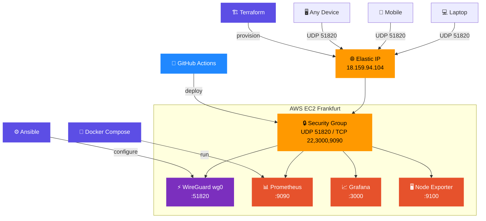

# WireGuard DevOps Infrastructure

## Architecture Diagram


A production-grade VPN server built with modern DevOps practices.

## Architecture
- **VPN:** WireGuard (UDP 51820)
- **Cloud:** AWS EC2 (Frankfurt - eu-central-1)
- **IaC:** Terraform
- **Configuration:** Ansible
- **Containers:** Docker + Docker Compose
- **Monitoring:** Prometheus + Grafana
- **CI/CD:** GitHub Actions

## Infrastructure
- EC2 Instance (t2.micro, Ubuntu 22.04)
- Elastic IP (Static)
- Security Group (UDP 51820, TCP 22, 3000, 9090)

## Monitoring Stack
- Prometheus (metrics collection)
- Grafana (visualization dashboard)
- Node Exporter (system metrics)

## CI/CD Pipeline
Auto-deploys on every push to main branch:
1. Checkout code
2. SSH into server
3. Pull latest Docker images
4. Restart containers
5. Health check (wg show)


## How to Deploy

### Step 1 — Provision infrastructure (Terraform)
```bash
cd terraform
terraform init
terraform apply
```

### Step 2 — Configure server (Ansible)
```bash
cd ansible
ansible-playbook -i inventory.ini playbook.yml
```

### Step 3 — Start monitoring (Docker)
```bash
ssh -i wireguard-key.pem ubuntu@18.159.94.104
cd monitoring
sudo docker-compose up -d
```

### Step 4 — CI/CD (GitHub Actions)
Auto-deploys on every push to main branch.

## Q/A

### 1. WireGuard vs OpenVPN kyun?
WireGuard UDP use karta hai jo TCP se faster hai, code base bhi chhota hai (4000 lines vs 70000), aur modern cryptography use karta hai.

### 2. UDP kyun VPN mein?
UDP connectionless hai isliye latency kam hoti hai — VPN ka apna error correction hota hai, TCP ki zaroorat nahi.

### 3. Terraform kyun?
Infrastructure as Code — ek command se poora server dobara ban jata hai, human error nahi, Git mein track hota hai.

### 4. Ansible kyun?
Server configuration automate hoti hai — 100 servers pe ek saath same config apply ho sakti hai.

### 5. Docker kyun monitoring ke liye?
Prometheus aur Grafana isolated containers mein hain — server pe koi conflict nahi, easily restart/update ho sakte hain.

### 6. CI/CD ka faida?
Code push hone pe automatically server update ho jata hai — manual SSH ki zaroorat nahi, human error zero.

### 7. Elastic IP kyun?
EC2 restart hone pe IP change ho jata hai — Elastic IP static rehta hai taake VPN clients reconnect na karein.

### 8. Server fail ho to kya?
Is project mein single server hai — production mein HAProxy + multiple servers lagta, yeh next improvement hai.
